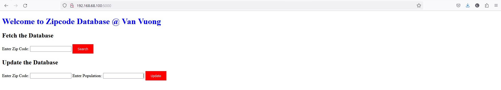

# Population by Zipcode

This repository contains data of the Zipcode and the population in the United States.

## Overview

The Zipcode and population is on the "zip_code_database.csv" file.

## Dataset

`zip_code_database.csv`: Contains the raw data of Zipcode and population.

## Usage

To use this repository:

1. Install Python 3 and dependencies

In order to run this program you must install python 3.11, as your interpreter, https://www.python.org/downloads/
The following python packages must also be installed, pandas, SQLAlchemy, pymysql, flask

2. Clone the repository:

```sh
git clone https://github.com/luongvv-rtc/Population-by-Zipcode

```

## Scope:
- Use Python to import the zip_code_database.csv file into MySQL database of LAMP/WAMP stack.
- Host a Web server (using port 5000)
- Use Python and flask:
	+ Launches web server on port 5000
	+ Queries the database (Zipcode) and returns information (Zipcode and Population)
	+ Update database (Zipcode and Population)
	+ Uses XML or JSON-packed messages to transport data

## Outcomes:

